# IOS Restaurant App

A mobile restaurant food ordering app built with Swift and Xcode.
Users can register, log in, browse the menu, add items to a cart, and place orders with multiple payment options.

## Features

- **User authentication**: Simple user login and register system.
- **About us page**: Simple introduction to the restaurant.
- **Menu Page**: Allowing user to browse, add to cart, delete from cart and add remark to the ordered food.
- **Checkout page**: User can choose either "Pay on item reach" or "Pay on credit card" during checking out.
- **History Page**: View user order history.

## Tech Stack

- **Language**: Swift
- **IDE**: Xcode

## Screenshots

- **Login Page**:

  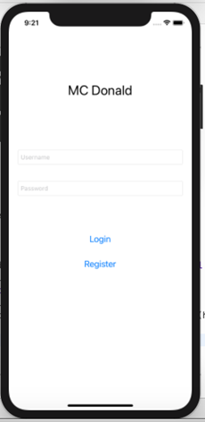

- **Register Page**:

  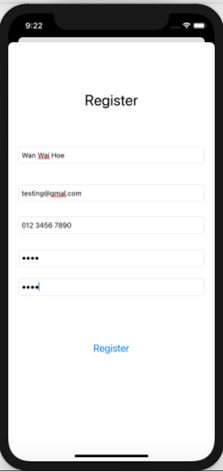
  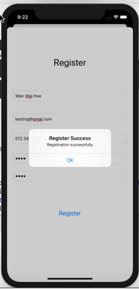

- **Home Page**:

  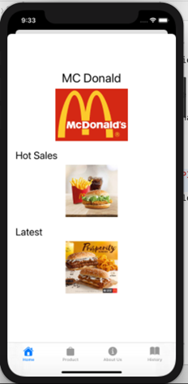

- **About us Page**:

  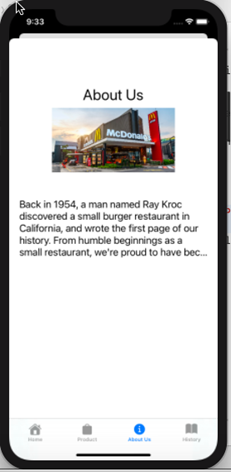

- **Menu Page**:

  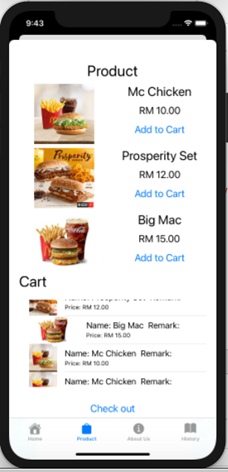

- **Cart deleting items**:

  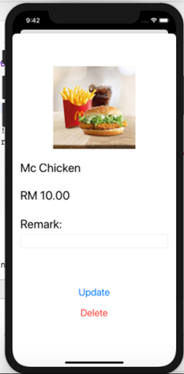
  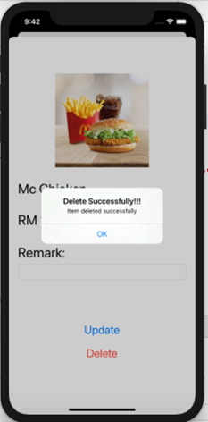

- **Checkout Process**:

  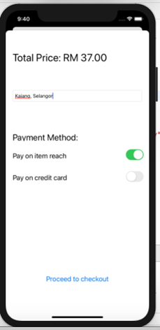
  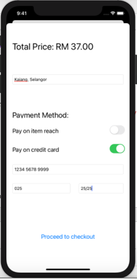
  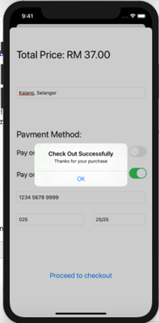

- **History Page**:

  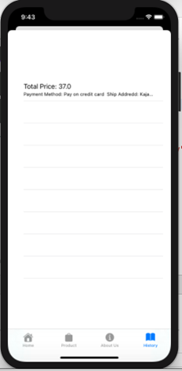

## Important Note

This project was originally created as a **student coursework**.  
The current repository contains the **recovered source code and screenshots**, but some original project files (such as the complete Xcode project configuration and assets) may be missing.

To run the app, you may need to:

- Create a new iOS project in Xcode
- Add the provided Swift source code files
- Reconfigure the storyboard, UI elements, and database connections (if required)

The repository is intended for **reference and showcase purposes only**.
